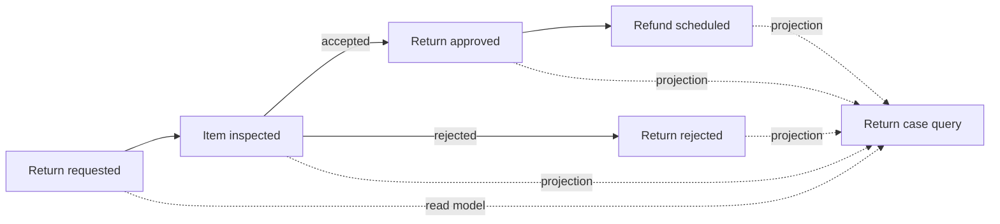
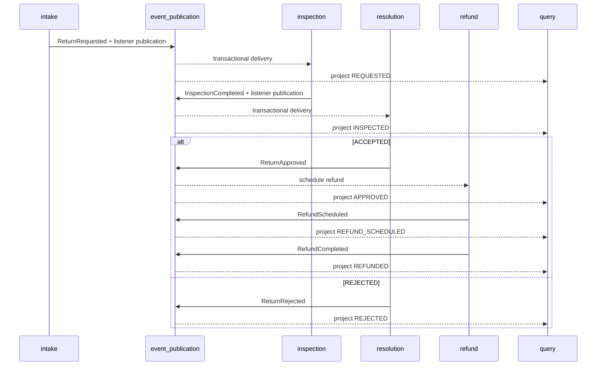
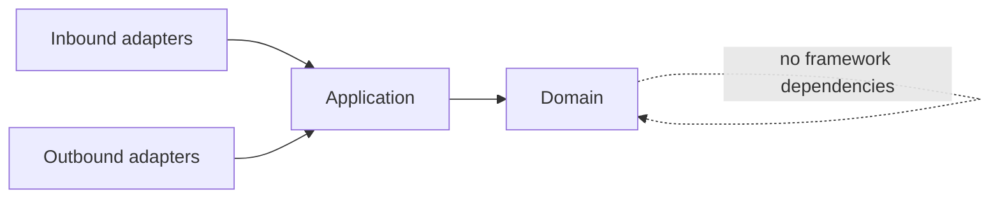

# Spring Architecture Patterns

[](https://github.com/wasiliy-strecker/spring-architecture-patterns/actions/workflows/verify.yml)
[](https://github.com/wasiliy-strecker/spring-architecture-patterns/releases/latest)
[](https://openjdk.org/projects/jdk/21/)
[](https://spring.io/projects/spring-boot)
[](LICENSE)

A production-minded Spring Boot reference application that demonstrates
architecture patterns through one coherent returns and refunds workflow.

The project is intentionally a modular monolith: business capabilities are
independently testable and protected by executable boundaries while deployment
and operational complexity stay low.

> **Current milestone — v1.0.0:** the first stable release packages the complete
> secured workflow as an executable JAR and a provenance-attested OCI image. An
> end-to-end scenario proves real JWT validation, asynchronous module
> collaboration, PostgreSQL persistence, metrics, and a hardened runtime.

## What this project demonstrates

- business-aligned modules rather than technical package silos
- Spring Modulith verification for cycles, exposed APIs, and allowed dependencies
- hexagonal boundaries inside each module
- framework-independent domain and application layers enforced with ArchUnit
- transaction demarcation through an application port rather than framework annotations
- PostgreSQL persistence owned by a JPA adapter and schema managed by Flyway
- transactional module events with Spring Modulith's JDBC publication registry
- idempotent consumers backed by atomic PostgreSQL conflict handling
- aggregate invariants plus optimistic locking for concurrent completion attempts
- durable refund scheduling with idempotent provider acknowledgements
- CQRS projection with event deduplication and monotonic workflow ranks
- stateless JWT security with signature, issuer, audience, and scope validation
- explicit transport DTOs plus RFC 9457 problem details and request correlation
- public liveness/readiness probes and protected Prometheus diagnostics
- bounded, audit-logged recovery for incomplete Modulith event publications
- layered OCI packaging with a non-root user and read-only runtime filesystem
- ephemeral-key HTTP end-to-end verification across the Compose boundary
- isolated module scenarios that verify collaboration through public events
- deterministic unit tests plus real PostgreSQL integration tests with Testcontainers
- generated module diagrams that cannot silently drift from the code
- Java 21 baseline with Java 21 and Java 25 CI verification

## Business workflow



The complete domain flow from intake through refund completion is implemented.
The read side independently projects all workflow events and remains correct
when those events arrive late or are delivered again.

## Implemented use cases

```java
ReturnReceipt receipt =
    returnIntake.request(
        new RequestReturnCommand(
            "ORDER-1001",
            "LINE-2",
            "DAMAGED",
            "Outer packaging was crushed.",
            12_500,
            "EUR"));

InspectionReceipt inspection =
    inspectionWork.complete(
        new CompleteInspectionCommand(
            receipt.returnId(),
            "ACCEPTED",
            "Damage confirmed by warehouse."));

// Called after the asynchronous RefundScheduled instruction is visible.
RefundReceipt refund =
    refundOperations.settle(
        new SettleRefundCommand(
            receipt.returnId(),
            "PSP-ORDER-1001"));

// The query API is eventually consistent.
ReturnCaseView view =
    returnCaseQueries.findById(receipt.returnId()).orElseThrow();
```

The application normalizes and validates the request, rejects a duplicate
order-item pair, inserts it within a transaction, and publishes
`ReturnRequested`. The event exposes only identifiers, scalar values, and a
timestamp—not a JPA entity or internal aggregate.

The inspection listener registers pending work asynchronously. The aggregate
allows one completion transition, and JPA optimistic locking resolves competing
writes. `ACCEPTED` produces a full-refund `ReturnApproved`; `REJECTED` produces
`ReturnRejected` with the stable reason `INSPECTION_FAILED`.

An approval asynchronously creates exactly one `RefundScheduled` instruction.
`RefundOperations` records the acknowledgement from an external payment
provider and emits `RefundCompleted`. Repeating the same provider reference is
safe; attempting to rewrite it is rejected. The project deliberately does not
pretend to transfer real money or hide a payment SDK behind a demo stub.

## Secured HTTP boundary

The inbound adapters expose four business operations. Each token needs only the
scope required for that operation:

| Method | Path | Required scope | Semantics |
|---|---|---|---|
| `POST` | `/api/v1/returns` | `returns:write` | Request one return and receive `201 Created` |
| `POST` | `/api/v1/returns/{returnId}/inspection` | `returns:inspect` | Complete the warehouse inspection |
| `PUT` | `/api/v1/returns/{returnId}/refund` | `refunds:settle` | Idempotently record the provider acknowledgement |
| `GET` | `/api/v1/returns/{returnId}` | `returns:read` | Read the eventually consistent case view |

The resource server validates an RSA signature as well as `iss`, `aud`, token
time bounds, and scopes. Its RFC 9728 metadata is public at
`/.well-known/oauth-protected-resource`. Authentication and authorization
failures keep the RFC 6750 `WWW-Authenticate` header and also return a stable
problem response:

```json
{
  "type": "https://wasiliy-strecker.github.io/problems/insufficient-scope",
  "title": "Insufficient scope",
  "status": 403,
  "detail": "The bearer token does not grant the required scope.",
  "instance": "/api/v1/returns/6dca7023-9098-4936-9e8c-1a48082ddc13",
  "code": "INSUFFICIENT_SCOPE",
  "requestId": "request-401"
}
```

Set these environment variables for an authorization server:

```bash
export JWT_PUBLIC_KEY_LOCATION=file:/run/secrets/returns-api-public-key.pem
export JWT_ISSUER_URI=https://auth.example.com
export JWT_AUDIENCE=returns-api
```

The repository contains only a non-secret bootstrap public key so the
application can start without contacting an identity provider. Its private key
is deliberately unavailable; use an authorization server and override the
public-key location for real requests.

## Operational insight and recovery

`/livez`, `/readyz`, and the detailed liveness/readiness actuator paths are
public for platform probes. Diagnostics remain protected:

| Method | Path | Required scope |
|---|---|---|
| `GET` | `/actuator/prometheus` | `operations:read` |
| `GET` | `/actuator/eventpublications` | `operations:read` |
| `POST` | `/actuator/eventpublications` | `operations:manage` |

The Prometheus registry exports the incomplete count, failed count, and age of
the oldest incomplete publication. Recovery is never automatic at startup. An
operator must request a bounded batch with a minimum age of at least 30 seconds:

```bash
curl --request POST http://localhost:8080/actuator/eventpublications \
  --header "Authorization: Bearer ${ACCESS_TOKEN}" \
  --header "Content-Type: application/json" \
  --data '{
    "minAge": "PT5M",
    "maxInFlight": 20,
    "batchSize": 100
  }'
```

The acknowledgement records how many eligible publications were observed. It
does not claim that asynchronous handling has already succeeded; the metrics
and read endpoint show the resulting state.



## Module map

| Module | Responsibility | Intended public collaboration |
|---|---|---|
| `intake` | Capture and validate a return request | API and `ReturnRequested` event |
| `inspection` | Record the physical inspection once | API and `InspectionCompleted` event |
| `resolution` | Decide approval or rejection | Resolution events |
| `refund` | Schedule and settle an approved refund once | API and refund events |
| `query` | Build monotonic, read-optimized return case views | Query API |
| `operations` | Diagnose and recover durable event delivery | Actuator endpoint and metrics |

Every module owns its domain, use cases, and adapters. Other modules may use only
explicitly exposed APIs or named event interfaces.

## Architecture guardrails



`ApplicationModulesTest` verifies the Spring Modulith model and generates
PlantUML plus module canvases under `target/spring-modulith-docs`.
`ArchitectureRulesTest` prevents domain and application code from depending on
Spring, Jakarta Persistence, or servlet APIs and enforces inward dependency
direction.

See [the architecture notes](docs/architecture.md) for the decisions and
planned dependency direction.

## Two-minute review

1. Start with the
   [public intake facade](src/main/java/io/github/wasiliystrecker/returns/intake/ReturnIntake.java).
2. Follow `ReturnRequested` into the idempotent
   [inspection listener](src/main/java/io/github/wasiliystrecker/returns/inspection/adapter/ReturnRequestedListener.java).
3. Review the one-way state transition in
   [InspectionCase](src/main/java/io/github/wasiliystrecker/returns/inspection/domain/InspectionCase.java)
   and its
   [completion use case](src/main/java/io/github/wasiliystrecker/returns/inspection/application/CompleteInspectionService.java).
4. Inspect the deterministic
   [resolution policy](src/main/java/io/github/wasiliystrecker/returns/resolution/domain/ResolutionPolicy.java)
   and the idempotent
   [refund aggregate](src/main/java/io/github/wasiliystrecker/returns/refund/domain/RefundPayment.java).
5. Review the
   [monotonic JDBC projection](src/main/java/io/github/wasiliystrecker/returns/query/adapter/persistence/JdbcReturnCaseProjectionRepository.java).
6. Inspect the
   [scope rules and problem responses](src/main/java/io/github/wasiliystrecker/returns/ApiSecurityConfiguration.java)
   and one
   [HTTP adapter](src/main/java/io/github/wasiliystrecker/returns/intake/adapter/web/ReturnIntakeController.java).
7. Follow the guarded recovery path through the
   [operations service](src/main/java/io/github/wasiliystrecker/returns/operations/application/EventPublicationOperationsService.java)
   and
   [Actuator endpoint](src/main/java/io/github/wasiliystrecker/returns/operations/adapter/actuator/EventPublicationsEndpoint.java).
8. Finish with the
   [cross-module PostgreSQL test](src/test/java/io/github/wasiliystrecker/returns/ReturnWorkflowIT.java)
   and [delivery semantics](docs/architecture.md#delivery-semantics).
9. Review the hardened [runtime image](Dockerfile) and the
   [executable container workflow](scripts/container-e2e.sh).

## Build

Requirements: a full JDK from version 21 through 25 and Docker for the
PostgreSQL integration test. The Maven Wrapper downloads the pinned Maven
distribution.

```bash
./mvnw clean verify
```

Run only the fast architecture checks:

```bash
./mvnw test -Dtest=ApplicationModulesTest,ArchitectureRulesTest
```

Run all unit and architecture checks without integration tests:

```bash
./mvnw clean verify -DskipITs
```

## Container end-to-end example

Requirements: Docker with the Compose plugin, `curl`, `jq`, and `openssl`.

```bash
./scripts/container-e2e.sh
```

The script builds the layered image, starts PostgreSQL and the application,
creates a temporary RSA key pair, and signs two ten-minute JWTs. It verifies
`401` and `403` boundaries before driving an accepted return through inspection,
refund scheduling, provider acknowledgement, the final CQRS view, and a
protected Prometheus scrape.

The private key exists only in a restricted temporary directory. Cleanup
removes the key, containers, network, and database volume even when a check
fails. The script also proves that the application runs as UID/GID `10001` with
a read-only root filesystem.

For an interactive local environment:

```bash
docker compose up --build --wait
```

The default Compose environment uses the repository's public-only bootstrap
key, so it can start safely but cannot mint an access token. To call secured
endpoints, point `JWT_PUBLIC_KEY_FILE` at the public key belonging to your local
authorization server. See [the container notes](docs/container.md) for the
runtime contract and production boundaries.

Run the published `v1.0.0` image with the same topology:

```bash
docker pull ghcr.io/wasiliy-strecker/spring-architecture-patterns:1.0.0
APP_IMAGE=ghcr.io/wasiliy-strecker/spring-architecture-patterns \
  IMAGE_VERSION=1.0.0 \
  docker compose up --no-build --wait
```

The [GitHub release](https://github.com/wasiliy-strecker/spring-architecture-patterns/releases/tag/v1.0.0)
also contains the executable JAR and its SHA-256 checksum. The release workflow
publishes image provenance and an SBOM as OCI attestations in GHCR.

Start PostgreSQL for the application:

```bash
docker run --rm --name returns-postgres \
  -e POSTGRES_DB=returns \
  -e POSTGRES_USER=returns \
  -e POSTGRES_PASSWORD=returns \
  -p 5432:5432 \
  postgres:18.3-alpine
```

Then run the application in a second terminal:

```bash
./mvnw spring-boot:run
```

Flyway creates the schema and Hibernate validates that its mapping matches it.

## Technology choices

- Java 21
- Spring Boot 4.1
- Spring Modulith 2.1
- PostgreSQL 18 and Flyway
- Spring Data JPA
- Spring Security OAuth 2.0 Resource Server
- Spring MVC and Jakarta Bean Validation
- Spring Boot Actuator, Micrometer, and Prometheus
- Testcontainers 2.0
- JUnit and AssertJ
- ArchUnit
- Maven Wrapper and Spotless
- GitHub Actions
- Docker and Docker Compose

## Roadmap

- [x] Executable modular-monolith foundation
- [x] Return intake and PostgreSQL persistence
- [x] Inspection and resolution modules
- [x] Reliable refund handling and query projections
- [x] Secured REST API and operational insight
- [x] Layered container packaging and hardened Compose runtime
- [x] Signed HTTP end-to-end example
- [x] First stable release

Design choices are recorded in [docs/architecture.md](docs/architecture.md).

## License

Licensed under the [Apache License 2.0](LICENSE).
