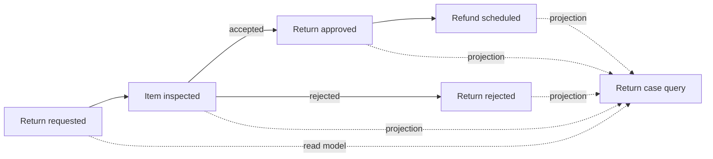
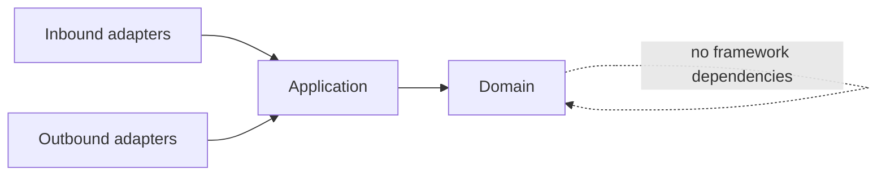

# Spring Architecture Patterns

[](https://github.com/wasiliy-strecker/spring-architecture-patterns/actions/workflows/verify.yml)
[](https://openjdk.org/projects/jdk/21/)
[](https://spring.io/projects/spring-boot)
[](LICENSE)

A production-minded Spring Boot reference application that demonstrates
architecture patterns through one coherent returns and refunds workflow.

The project is intentionally a modular monolith: business capabilities are
independently testable and protected by executable boundaries while deployment
and operational complexity stay low.

> **Current milestone — architecture foundation:** the five application modules,
> build, documentation generation, and architecture tests are in place. Business
> behavior is added incrementally so that every commit remains reviewable.

## What this project demonstrates

- business-aligned modules rather than technical package silos
- Spring Modulith verification for cycles, exposed APIs, and allowed dependencies
- hexagonal boundaries inside each module
- framework-independent domain and application layers enforced with ArchUnit
- generated module diagrams that cannot silently drift from the code
- Java 21 baseline with Java 21 and Java 25 CI verification

## Business workflow



The planned reference flow covers intake, warehouse inspection, a deterministic
resolution policy, refund scheduling, and an eventually consistent query view.
The repository does not claim that these business features are implemented
until their milestone is merged.

## Module map

| Module | Responsibility | Intended public collaboration |
|---|---|---|
| `intake` | Capture and validate a return request | API and `ReturnRequested` event |
| `inspection` | Record the physical inspection once | API and `InspectionCompleted` event |
| `resolution` | Decide approval or rejection | Resolution events |
| `refund` | Schedule an approved refund | API and refund event |
| `query` | Build read-optimized return case views | Query API |

Every module will own its domain, use cases, and adapters. Other modules may use
only explicitly exposed APIs or named event interfaces.

## Architecture guardrails



`ApplicationModulesTest` verifies the Spring Modulith model and generates
PlantUML plus module canvases under `target/spring-modulith-docs`.
`ArchitectureRulesTest` prevents domain and application code from depending on
Spring, Jakarta Persistence, or servlet APIs.

See [the architecture notes](docs/architecture.md) for the decisions and
planned dependency direction.

## Build

Requirements: a full JDK from version 21 through 25. The Maven Wrapper downloads
the pinned Maven distribution.

```bash
./mvnw clean verify
```

Run only the fast architecture checks:

```bash
./mvnw test -Dtest=ApplicationModulesTest,ArchitectureRulesTest
```

Start the foundation application locally:

```bash
./mvnw spring-boot:run
```

No database is required for the foundation milestone. PostgreSQL, Flyway, and
Testcontainers arrive with the first persistence-backed use case.

## Technology choices

- Java 21
- Spring Boot 4.1
- Spring Modulith 2.1
- JUnit and AssertJ
- ArchUnit
- Maven Wrapper and Spotless
- GitHub Actions

## Roadmap

- [x] Executable modular-monolith foundation
- [ ] Return intake and PostgreSQL persistence
- [ ] Inspection and resolution modules
- [ ] Reliable refund handling and query projections
- [ ] Secured REST API and operational insight
- [ ] Container packaging, end-to-end example, and first release

Design choices are recorded in [docs/architecture.md](docs/architecture.md).

## License

Licensed under the [Apache License 2.0](LICENSE).
