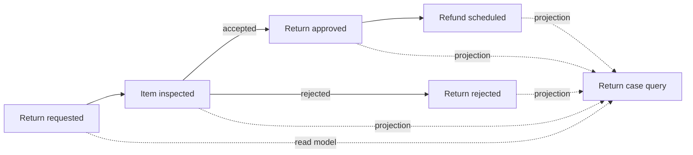
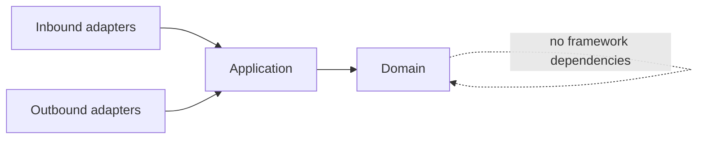

# Spring Architecture Patterns

[](https://github.com/wasiliy-strecker/spring-architecture-patterns/actions/workflows/verify.yml)
[](https://openjdk.org/projects/jdk/21/)
[](https://spring.io/projects/spring-boot)
[](LICENSE)

A production-minded Spring Boot reference application that demonstrates
architecture patterns through one coherent returns and refunds workflow.

The project is intentionally a modular monolith: business capabilities are
independently testable and protected by executable boundaries while deployment
and operational complexity stay low.

> **Current milestone — return intake:** the first business module validates and
> stores return requests in PostgreSQL and publishes a stable domain event.
> Inspection, resolution, refunds, and query projections remain explicit roadmap
> items rather than placeholder implementations.

## What this project demonstrates

- business-aligned modules rather than technical package silos
- Spring Modulith verification for cycles, exposed APIs, and allowed dependencies
- hexagonal boundaries inside each module
- framework-independent domain and application layers enforced with ArchUnit
- transaction demarcation through an application port rather than framework annotations
- PostgreSQL persistence owned by a JPA adapter and schema managed by Flyway
- deterministic unit tests plus real PostgreSQL integration tests with Testcontainers
- generated module diagrams that cannot silently drift from the code
- Java 21 baseline with Java 21 and Java 25 CI verification

## Business workflow



Return intake is implemented. The remaining reference flow covers warehouse
inspection, a deterministic resolution policy, refund scheduling, and an
eventually consistent query view. The repository does not claim those later
features until their milestones are merged.

## Implemented use case

```java
ReturnReceipt receipt =
    returnIntake.request(
        new RequestReturnCommand(
            "ORDER-1001",
            "LINE-2",
            "DAMAGED",
            "Outer packaging was crushed.",
            12_500,
            "EUR"));
```

The application normalizes and validates the request, rejects a duplicate
order-item pair, inserts it within a transaction, and publishes
`ReturnRequested`. The event exposes only identifiers, scalar values, and a
timestamp—not a JPA entity or internal aggregate.

## Module map

| Module | Responsibility | Intended public collaboration |
|---|---|---|
| `intake` | Capture and validate a return request | API and `ReturnRequested` event |
| `inspection` | Record the physical inspection once | API and `InspectionCompleted` event |
| `resolution` | Decide approval or rejection | Resolution events |
| `refund` | Schedule an approved refund | API and refund event |
| `query` | Build read-optimized return case views | Query API |

Every module owns its domain, use cases, and adapters. Other modules may use only
explicitly exposed APIs or named event interfaces.

## Architecture guardrails



`ApplicationModulesTest` verifies the Spring Modulith model and generates
PlantUML plus module canvases under `target/spring-modulith-docs`.
`ArchitectureRulesTest` prevents domain and application code from depending on
Spring, Jakarta Persistence, or servlet APIs and enforces inward dependency
direction.

See [the architecture notes](docs/architecture.md) for the decisions and
planned dependency direction.

## Two-minute review

1. Start with the
   [public intake facade](src/main/java/io/github/wasiliystrecker/returns/intake/ReturnIntake.java).
2. Follow it into the
   [framework-independent use case](src/main/java/io/github/wasiliystrecker/returns/intake/application/RequestReturnService.java).
3. Inspect the immutable
   [domain aggregate](src/main/java/io/github/wasiliystrecker/returns/intake/domain/ReturnRequest.java)
   and [money value object](src/main/java/io/github/wasiliystrecker/returns/intake/domain/Money.java).
4. Review the
   [JPA adapter](src/main/java/io/github/wasiliystrecker/returns/intake/adapter/persistence/JpaReturnRequestRepository.java)
   and [Flyway constraints](src/main/resources/db/migration/V1__create_return_request.sql).
5. Finish with the
   [PostgreSQL integration test](src/test/java/io/github/wasiliystrecker/returns/intake/adapter/persistence/ReturnIntakePersistenceIT.java).

## Build

Requirements: a full JDK from version 21 through 25 and Docker for the
PostgreSQL integration test. The Maven Wrapper downloads the pinned Maven
distribution.

```bash
./mvnw clean verify
```

Run only the fast architecture checks:

```bash
./mvnw test -Dtest=ApplicationModulesTest,ArchitectureRulesTest
```

Run all unit and architecture checks without integration tests:

```bash
./mvnw clean verify -DskipITs
```

Start PostgreSQL for the application:

```bash
docker run --rm --name returns-postgres \
  -e POSTGRES_DB=returns \
  -e POSTGRES_USER=returns \
  -e POSTGRES_PASSWORD=returns \
  -p 5432:5432 \
  postgres:18.3-alpine
```

Then run the application in a second terminal:

```bash
./mvnw spring-boot:run
```

Flyway creates the schema and Hibernate validates that its mapping matches it.

## Technology choices

- Java 21
- Spring Boot 4.1
- Spring Modulith 2.1
- PostgreSQL 18 and Flyway
- Spring Data JPA
- Testcontainers 2.0
- JUnit and AssertJ
- ArchUnit
- Maven Wrapper and Spotless
- GitHub Actions

## Roadmap

- [x] Executable modular-monolith foundation
- [x] Return intake and PostgreSQL persistence
- [ ] Inspection and resolution modules
- [ ] Reliable refund handling and query projections
- [ ] Secured REST API and operational insight
- [ ] Container packaging, end-to-end example, and first release

Design choices are recorded in [docs/architecture.md](docs/architecture.md).

## License

Licensed under the [Apache License 2.0](LICENSE).
