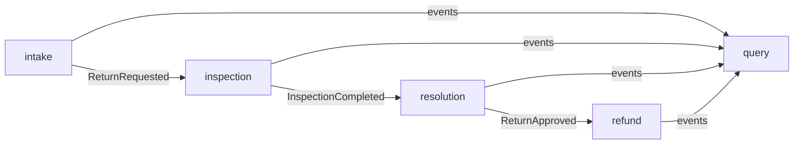
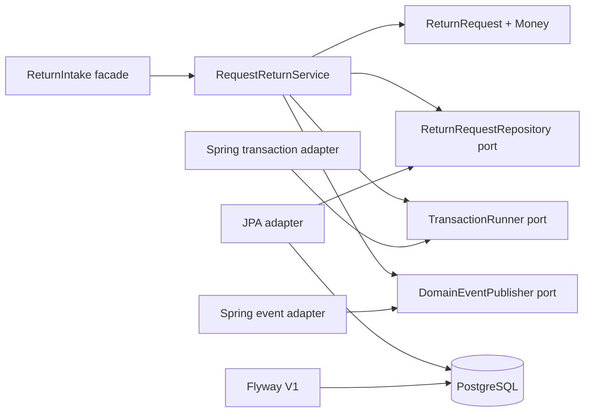
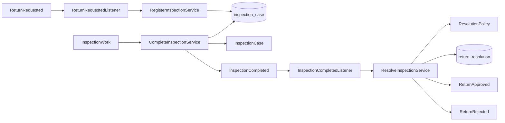
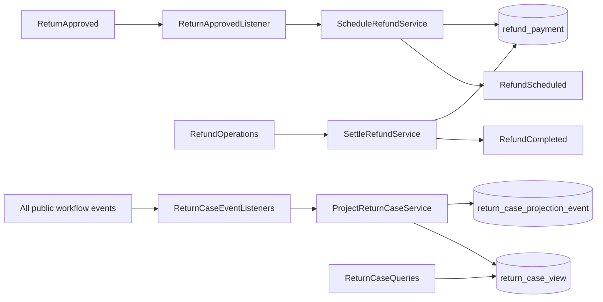

# Architecture

## Decision

The return and refund workflow is implemented as a functionally modular
monolith. One deployable unit is appropriate for the current scale, while
business modules and executable dependency rules preserve options for later
extraction.

This repository uses patterns only where they solve a visible problem. It does
not split a small workflow into networked services merely to demonstrate
microservices.

## Business modules



The complete path from `intake` through `refund` is implemented. `query`
subscribes independently to every public event and builds the read side without
introducing synchronous dependencies back into the write modules.

## Internal dependency rule

Each business module follows this direction:

```text
adapter -> application -> domain
```

- `domain` contains state, value objects, and business invariants.
- `application` coordinates use cases and declares outbound ports.
- `adapter` translates HTTP or persistence concerns at the boundary.

Domain and application packages cannot depend on Spring, Jakarta Persistence,
or servlet APIs. The domain cannot depend on application or adapter packages,
and the application cannot depend on adapters. ArchUnit enforces both rules.

## Return intake slice



`RequestReturnService` is constructed explicitly in Spring configuration but
contains no Spring annotation. A `TransactionRunner` port keeps transaction
semantics visible without coupling the use case to a framework. The JPA model
is separate from the immutable domain record, and Flyway repeats critical
invariants as database constraints.

## Inspection and resolution slices



`InspectionCase` is the authority for the one-way `PENDING → COMPLETED`
transition. The persistence adapter carries its version through JPA's
optimistic-lock field so two operators cannot both complete the same work.
Event redelivery is a different concern: registration and resolution use
PostgreSQL `INSERT … ON CONFLICT DO NOTHING`, making the idempotency decision
atomic instead of relying on a race-prone read-before-write check.

`ResolutionPolicy` is a pure, deterministic domain service. It maps
`ACCEPTED` to a full refund approval and `REJECTED` to the machine-readable
reason `INSPECTION_FAILED`. It knows nothing about events, Spring, or
persistence.

## Refund and query slices



The refund aggregate distinguishes instruction creation from provider
settlement. Scheduling is atomic on return and source-event identifiers.
Settlement stores an immutable provider reference, treats the same
acknowledgement as an idempotent retry, and uses optimistic locking to reject
competing rewrites. No database transaction is presented as a guarantee over an
external payment network.

The query module is a CQRS read side. A processed-event ledger deduplicates
stable event IDs in the same transaction as the projection update. Sparse
upserts allow later workflow events to arrive before intake data. A workflow
rank can advance but never decrease, while missing lower-rank attributes are
still filled when delayed events arrive.

## Cross-module contracts

Synchronous collaboration uses a small public facade in the module base package.
Asynchronous collaboration uses immutable events exposed through a named
`events` interface. Event payloads contain identifiers, primitives, and
timestamps rather than persistence entities or internal domain objects.

Spring Modulith verifies:

- no cycles between modules
- no access to another module's internals
- only explicitly allowed dependencies once collaboration is introduced

## Architectural test strategy

`ApplicationModulesTest` treats the discovered Spring Modulith model as an
executable specification. It verifies boundaries and produces diagrams and
module canvases from the compiled code.

`ArchitectureRulesTest` protects the framework-independent core.
`ReturnIntakePersistenceIT` starts the complete application against PostgreSQL,
exercises Flyway and Hibernate validation, checks the stored row and event, and
proves that a failing synchronous event listener rolls back persistence.
`InspectionModuleIT` and `ResolutionModuleIT` use Spring Modulith's `Scenario`
API to test each module only through exposed events and APIs.
`RefundModuleIT` verifies scheduling and provider acknowledgement, while
`QueryModuleIT` deliberately publishes events in reverse order.
`ReturnWorkflowIT` verifies the complete asynchronous path, publication
completion, optimistic version increments, duplicate delivery, settlement, and
the final read view against real PostgreSQL.

The generated documents live below `target/spring-modulith-docs` and are not
versioned; the source of truth remains the code and its verification tests.

## Delivery semantics

Business events are published inside the originating transaction. Spring
Modulith writes one `event_publication` row per transactional listener in that
same transaction, then invokes each `@ApplicationModuleListener` asynchronously
in a new transaction. A successful invocation marks its publication
`COMPLETED`; an interrupted or failed delivery remains visible for controlled
resubmission.

The application deliberately claims **at-least-once**, not exactly-once,
delivery. Events carry stable identifiers, write-side consumers use atomic
uniqueness constraints, and the query side keeps a processed-event ledger.
Automatic replay at startup stays disabled so operators do not trigger an
unbounded recovery storm; a later operations milestone will expose metrics and
an explicit resubmission procedure before production deployment.

The query API is explicitly eventually consistent. Callers must therefore
tolerate a short period in which a newly submitted return has no view yet.
