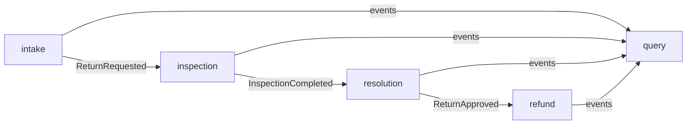

# Architecture

## Decision

The return and refund workflow is implemented as a functionally modular
monolith. One deployable unit is appropriate for the current scale, while
business modules and executable dependency rules preserve options for later
extraction.

This repository uses patterns only where they solve a visible problem. It does
not split a small workflow into networked services merely to demonstrate
microservices.

## Business modules



The arrows describe the target design. At the foundation milestone, the modules
are deliberately independent and contain no business dependencies yet.

## Internal dependency rule

Each business module follows this direction:

```text
adapter -> application -> domain
```

- `domain` contains state, value objects, and business invariants.
- `application` coordinates use cases and declares outbound ports.
- `adapter` translates HTTP or persistence concerns at the boundary.

Domain and application packages cannot depend on Spring, Jakarta Persistence,
or servlet APIs. ArchUnit enforces this rule.

## Cross-module contracts

Synchronous collaboration uses a small public facade in the module base package.
Asynchronous collaboration uses immutable events exposed through a named
`events` interface. Event payloads contain identifiers, primitives, and
timestamps rather than persistence entities or internal domain objects.

Spring Modulith verifies:

- no cycles between modules
- no access to another module's internals
- only explicitly allowed dependencies once collaboration is introduced

## Architectural test strategy

`ApplicationModulesTest` treats the discovered Spring Modulith model as an
executable specification. It verifies boundaries and produces diagrams and
module canvases from the compiled code.

`ArchitectureRulesTest` protects the framework-independent core. A
`SpringArchitecturePatternsApplicationTest` additionally proves that the
application context starts.

The generated documents live below `target/spring-modulith-docs` and are not
versioned; the source of truth remains the code and its verification tests.

## Planned delivery semantics

Business events will use Spring Modulith's JDBC event publication registry.
Listeners will execute asynchronously in their own transactions. This provides
at-least-once processing, not an exactly-once claim. Consumers will therefore
use stable event identifiers and idempotent state transitions.

The query module will be explicitly eventually consistent. Its projection uses
a monotonic workflow rank so delayed events cannot move a return case backwards.
