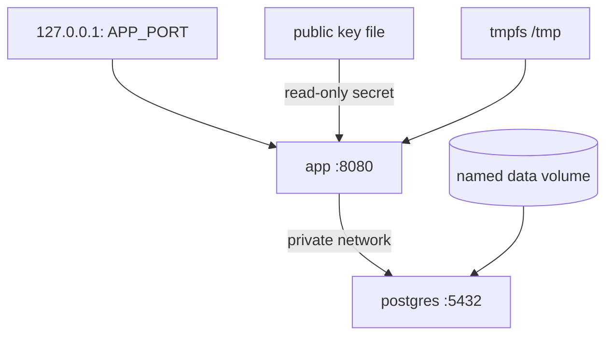

# Container runtime and end-to-end contract

## Image design

The Dockerfile uses two stages:

1. A Java 21 JDK stage resolves Maven dependencies, packages the application,
   and extracts the Spring Boot layers.
2. A Java 21 JRE stage receives only those layers and starts the executable
   application as UID/GID `10001`.

Dependencies, the Spring Boot loader, snapshot dependencies, and application
classes are copied separately. A business-code change therefore does not
invalidate the stable dependency layers. OCI labels record the source,
license, version, and revision.

The image declares `/readyz` as its health check and handles `SIGTERM`. Compose
adds a 30-second stop budget and a graceful Spring shutdown phase.

## Compose topology



Only the application port binds to the loopback interface. PostgreSQL remains
inside the Compose network and persists data in a named volume. The
application starts only after PostgreSQL is healthy and is considered ready
only after its own probe succeeds.

Runtime hardening for the application includes:

- a numeric non-root user
- a read-only root filesystem
- all Linux capabilities dropped
- `no-new-privileges`
- a bounded writable `/tmp` tmpfs
- a public key mounted independently from the image

The default database password is intentionally local-only. Supply external
configuration and secret management in any shared environment.

The end-to-end private key remains owner-only (`0600`). Its public counterpart
is mounted read-only (`0444`) so the numeric application user can verify
signatures without gaining access to signing material.

## Executable end-to-end scenario

Run:

```bash
./scripts/container-e2e.sh
```

The scenario:

1. creates a restricted temporary directory and an ephemeral RSA key pair
2. builds and starts the application plus PostgreSQL
3. confirms the container user and read-only root filesystem
4. proves unauthenticated and insufficient-scope responses
5. requests a return with a correctly signed JWT
6. completes inspection after its asynchronous registration
7. waits for the refund instruction in the CQRS projection
8. records the provider acknowledgement
9. waits for the final `REFUNDED` view
10. reads protected Prometheus metrics

Retries exist only at eventually consistent boundaries and have explicit time
limits. On failure, the script prints container state and logs. Its exit trap
always removes the private key, containers, network, and database volume.

Set `APP_PORT` to avoid a local port collision or
`E2E_START_TIMEOUT_SECONDS` for a slower builder:

```bash
APP_PORT=18081 E2E_START_TIMEOUT_SECONDS=240 ./scripts/container-e2e.sh
```

## Production boundary

This repository does not package an authorization server or claim that Compose
is a production orchestrator. Production requires independently managed JWT
keys, TLS, database backup and recovery, resource limits, image-signing policy,
and centralized observability.
